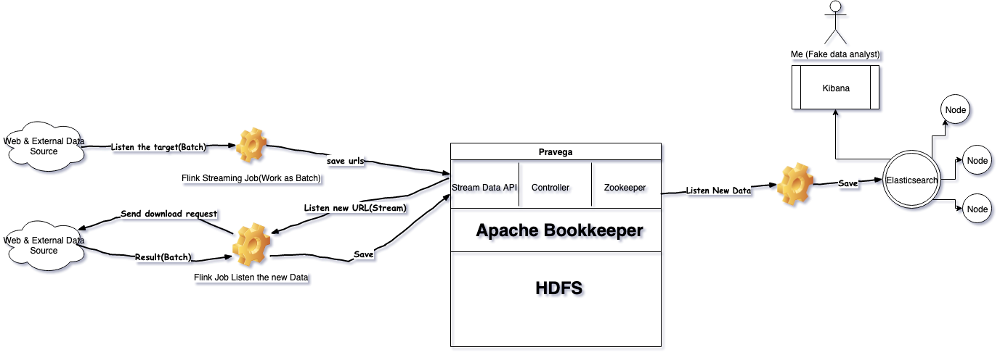

# Stream-processing-workshop

## Data Source- GDELT
### The GDELT Project
Supported by Google Jigsaw, the GDELT Project monitors the world's broadcast, print, and web news from nearly every corner of every country in over 100 languages and identifies the people, locations, organizations, themes, sources, emotions, counts, quotes, images and events driving our global society every second of every day, creating a free open platform for computing on the entire world.
**(Copied from official website)**

## Workflow

## Requirements
### Install and run Pravega
#### [Option 1] from installation package
* [Pravega Reference Quick Start Page](http://pravega.io/docs/latest/getting-started/)
* [Github Download Link: Version 0.4](https://github.com/pravega/pravega/releases/download/v0.4.0/pravega-0.4.0.tgz)

#### [Option 2] from docker
[//]<> (We must replace the <ip> with the IP of our machine to connect to Pravega from our local machine. Optionally we can replace latest with the version of Pravega as per the requirement.)

 
 `docker run -it -e HOST_IP=<ip> -p 9090:9090 -p 12345:12345 pravega/pravega:latest standalone`

### Install and run Flink
#### Run on docker 
* `docker pull flink:scala_2.11`
* `cd references/flink-docker`
* `docker-compose up`

### Download dependence via Maven
???

## Deploy your job to cluster
???
